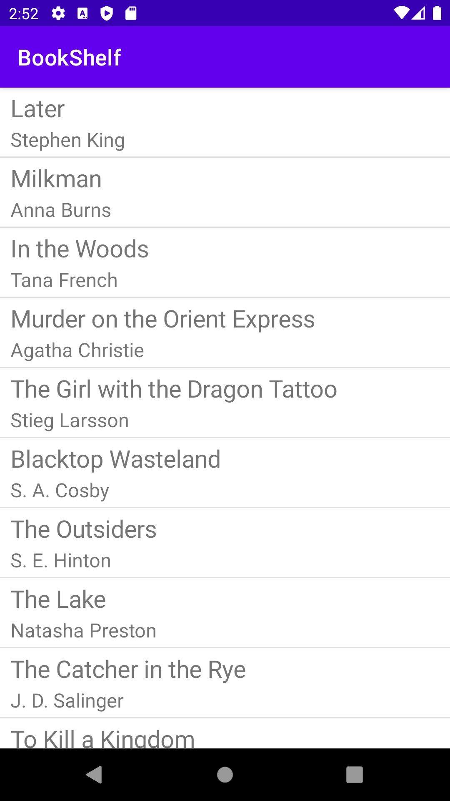
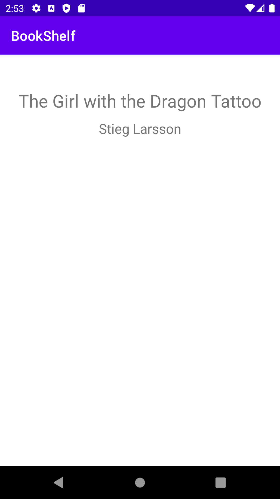
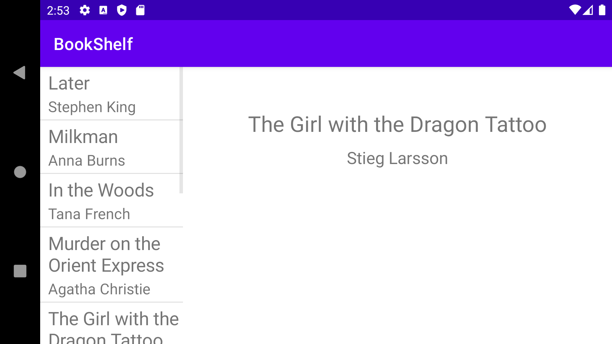
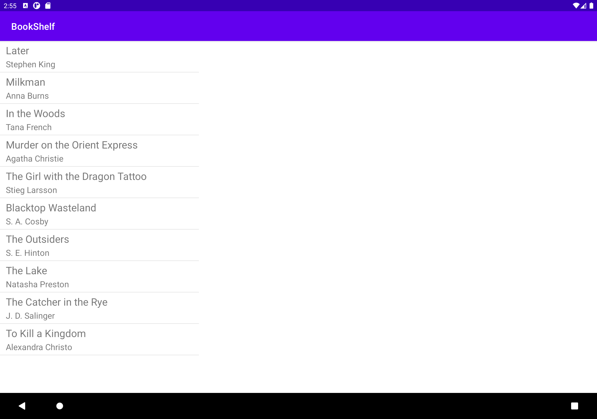
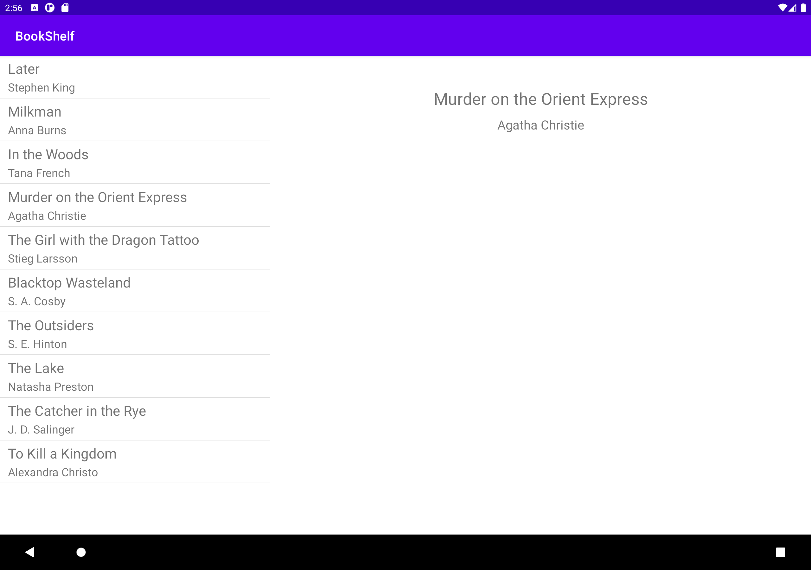

# BookShelf
In this lab, I created a Book object and a BookList to store Book objects.
We then used fragments to handle the display of books when our devices
are in portrait or landscape mode or it's a tablet.

